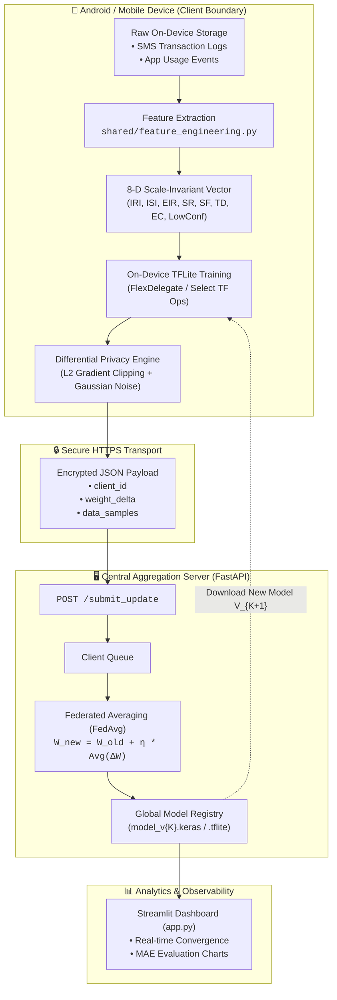

# AltScore Architecture & System Design

AltScore delivers a privacy-first federated credit-scoring system for gig workers. This document outlines the end-to-end architecture, multi-layer privacy defenses, and the federated training lifecycle in clear visual and text-based formats.

---

## 1. High-Level Architecture Diagram

```
+========================================================================================+
|                    📱 ON-DEVICE MOBILE CLIENT (Android / TFLite)                       |
|                                                                                        |
|  [ Private Raw Storage ]                                                               |
|    • SMS Logs (Bank/MobileMoney)                                                       |
|    • App Usage & Active Hours                                                          |
|               │                                                                        |
|               ▼                                                                        |
|  [ 1. Feature Extraction Layer ] (shared/feature_engineering.py & TFLiteModule.kt)    |
|    • 8-Dimensional Scale-Invariant Ratio Vector:                                       |
|        [ IRI, ISI, EIR, SR, SF, TD, EC, LowConfidenceFlag ]                            |
|    • (No absolute income or spending figures ever enter the model)                     |
|               │                                                                        |
|               ▼                                                                        |
|  [ 2. On-Device Training & Inference ]                                                 |
|    • TensorFlow Lite Interpreter (FlexDelegate / Select TF Ops)                        |
|    • Local Fine-Tuning (E epochs on user's windowed batches)                           |
|    • Weight Delta Computation: ΔW = W_tuned - W_initial                                |
|               │                                                                        |
|               ▼                                                                        |
|  [ 3. Privacy & Protection Engine ]                                                    |
|    • Differential Privacy (DP): L2-norm Gradient Clipping + Gaussian Noise             |
|    • Payload Serialization & Signing                                                   |
+========================================================================================+
                                        │
                                        │ 🔒 Secure HTTPS Payload:
                                        │    { client_id, weight_delta, data_samples }
                                        ▼
+========================================================================================+
|                       🖥️ CENTRAL AGGREGATION SERVER (FastAPI)                          |
|                                                                                        |
|  [ Ingestion & Buffer ]                                                                |
|    • Endpoint: POST /submit_update                                                     |
|    • Collects K client model updates per round into incoming buffer                    |
|               │                                                                        |
|               ▼                                                                        |
|  [ Federated Averaging Engine (FedAvg) ]                                               |
|    • W_global = W_global + η * Σ( n_k * ΔW_k ) / N                                     |
|    • Global Model Checkpointing (model_v{K}.keras & global_model_v{K}.tflite)          |
|               │                                                                        |
|               ├─────────────────────────────────────────┐                              |
|               ▼                                         ▼                              |
|  [ Model Distribution ]                 [ Observability & Monitoring ]                 |
|    • Serves updated base_model.tflite     • Streamlit Analytics Dashboard (app.py)     |
|      back to mobile clients for next round• MAE convergence, client loss & rounds      |
+========================================================================================+
```

---

## 2. Four-Layer Privacy Defense Model

```
 ┌──────────────────────────────────────────────────────────────────────────────────┐
 │ Layer 1: Edge Computing Boundary (Federated Learning)                            │
 │ • Raw data (SMS text, active session timestamps) NEVER leaves the phone.         │
 └────────────────────────────────────────┬─────────────────────────────────────────┘
                                          │
                                          ▼
 ┌──────────────────────────────────────────────────────────────────────────────────┐
 │ Layer 2: Scale-Invariant Feature Representation                                  │
 │ • Model consumes dimensionless ratios (Savings Rate, Income Stability).         │
 │ • Absolute income figures ($ amounts) do not exist in the feature vector.        │
 └────────────────────────────────────────┬─────────────────────────────────────────┘
                                          │
                                          ▼
 ┌──────────────────────────────────────────────────────────────────────────────────┐
 │ Layer 3: Differential Privacy (DP Noise Injection)                               │
 │ • Local updates are L2-norm clipped and injected with calibrated Gaussian noise. │
 │ • Mathematically bounds information leakage to prevent model inversion attacks.  │
 └────────────────────────────────────────┬─────────────────────────────────────────┘
                                          │
                                          ▼
 ┌──────────────────────────────────────────────────────────────────────────────────┐
 │ Layer 4: Secure Transport & Authentication                                       │
 │ • Weight delta tensors are encrypted in transit over TLS.                        │
 └──────────────────────────────────────────────────────────────────────────────────┘
```

---

## 3. End-to-End Training & Scoring Lifecycle

```
Mobile Client (Phone)                                 Server (FastAPI)
      │                                                      │
      │ 1. Download initial base_model.tflite                │
      │◄─────────────────────────────────────────────────────│
      │                                                      │
      │ 2. Read local 30-day SMS logs & usage metrics        │
      │ 3. Transform into 8-D financial behavior ratios      │
      │ 4. Train local model on device (TFLite)              │
      │ 5. Compute weight delta: ΔW = W_local - W_global     │
      │ 6. Inject Differential Privacy noise                 │
      │                                                      │
      │ 7. Send update: POST /submit_update (Noisy ΔW)       │
      │─────────────────────────────────────────────────────►│
      │                                                      │
      │                                                      │ 8. Aggregate K clients
      │                                                      │    via FedAvg
      │                                                      │ 9. Save new global model
      │                                                      │
      │ 10. Receive new global_model_v{K+1}.tflite           │
      │◄─────────────────────────────────────────────────────│
      │                                                      │
      │ 11. Run local on-device inference                    │
      │     to calculate user's AltScore [300 - 850]         │
      ▼                                                      ▼
```

---

## 4. Mermaid Interactive Diagram (GitHub / Markdown Viewers)


