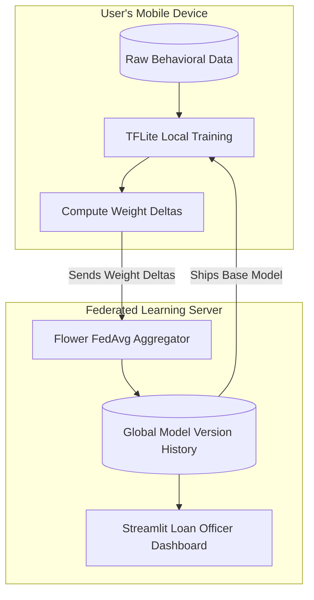

# AltScore

**Privacy-First Credit Scoring for Gig Workers via On-Device Federated Learning**

AltScore is a decentralized credit scoring platform designed for gig economy workers. Instead of centralizing highly sensitive personal data (like daily app usage, locations, and income streams), AltScore uses **on-device Federated Learning**. A base Machine Learning model is shipped to the user's phone, which then trains itself locally on their raw behavioral data. Only the resulting mathematical "weight deltas" are sent back to the server, preserving absolute privacy while generating highly accurate credit reliability scores.

---

## The Problem
Millions of gig workers globally remain unbanked or underbanked because they lack traditional credit histories. While behavioral and gig-platform data (hours active, session counts, daily micro-income) is highly predictive of creditworthiness, collecting this data centrally poses a massive privacy and security risk. Users shouldn't have to surrender their raw, minute-by-minute behavioral data to a central database just to prove they are reliable borrowers.

---

## How It Works
AltScore completely reverses the traditional data-collection paradigm:
1. **Base Model Distribution:** A pre-trained base model is shipped within the mobile app.
2. **Local Training:** The app reads the user's raw gig data locally and invokes TensorFlow Lite (TFLite) native training signatures on the device itself.
3. **Delta Extraction:** After local fine-tuning, the app exports the updated model weights, computes the difference (delta) from the base model, and securely transmits *only* this delta to the server.
4. **Federated Aggregation (FedAvg):** The FastAPI server uses the Flower framework to aggregate deltas from thousands of devices asynchronously.
5. **Global Update:** The server produces a new, smarter global base model that is redistributed to all clients.



---

## Tech Stack

| Component | Technologies Used |
|-----------|-------------------|
| **Mobile App** | React Native (Expo bare workflow), custom Kotlin Native Modules |
| **Machine Learning** | TensorFlow, Keras, TFLite (with `train`, `infer`, `save`, `restore`, `export_weights` signatures) |
| **Backend API** | Python, FastAPI, Flower (Federated Learning), SQLite |
| **Dashboard** | Streamlit (for Loan Officer visualization) |

---

## Repository Structure

- `data/` - Scripts for generating synthetic gig-worker behavioral and income data.
- `shared/` - Core Python ML code, including the Keras-to-TFLite export logic (`pretrain.py`) that defines the on-device training signatures.
- `simulation/` - End-to-end Python testbed evaluating Federated Learning vs. Centralized vs. Isolated training paradigms.
- `mobile/` - The React Native mobile app containing the custom Android Kotlin TFLite bridging logic (`TFLiteModule.kt`).
- `server/` - FastAPI backend for receiving model updates and executing Federated Averaging.
- `dashboard/` - Streamlit web interface for visualizing global model improvements and user credit reliability.

---

## Setup & Run Instructions

### 1. Federated Simulation (Python)
To prove the mathematical viability of the approach before deploying to mobile:
```bash
cd simulation
python run_simulation.py
```

### 2. FastAPI Server
Starts the federated aggregator API:
```bash
cd server
python -m uvicorn main:app --host 0.0.0.0 --port 8000 --reload
```

### 3. Streamlit Dashboard
Launch the loan officer view:
```bash
cd dashboard
streamlit run app.py
```

### 4. Mobile App (Android)
*Note: Ensure you have JDK 17 installed. The project uses the `foojay-resolver-convention` 1.0.0 pin in `settings.gradle` and relies on `gradle-daemon-jvm` to enforce JDK 17.*
```bash
cd mobile
npm install
npm start # Starts the Metro bundler
```
In a separate terminal, compile and install the Android app:
```bash
cd mobile/android
./gradlew assembleDebug
adb install -r app/build/outputs/apk/debug/app-debug.apk
```

---

## Current Status
- **✅ Federated Simulation:** End-to-end Python evaluation suite is fully operational.
- **✅ Backend & Dashboard:** API successfully receives deltas and tracks model lineage; Streamlit dashboard visualizes results.
- **✅ Mobile On-Device Training:** Real (not simulated) TFLite training runs successfully on Android via a custom Kotlin JNI bridge. The training loop runs on a dedicated background thread to prevent UI blocking (ANR), with proper memory handling for multi-dimensional tensors using flattened `FloatBuffer` allocations.
- **🚧 Known Limitations:** iOS native bridging is not yet implemented (Android-only currently). Security hardening (e.g., Secure Aggregation, Differential Privacy) is planned for future iterations.

---

## Key Results
Based on a rigorous multi-seed evaluation in our simulation environment, AltScore proves that privacy does not require sacrificing accuracy:

- **Centralized Training (The Privacy Nightmare):** ~0.0913 MAE
- **Federated Learning (AltScore):** **~0.0908 MAE**
- **Isolated Device Training (No Collaboration):** ~0.1551 MAE

*Conclusion:* AltScore's Federated Learning approach achieves predictive accuracy that is statistically indistinguishable from a centralized data-pooling approach, while **completely preserving user privacy**. Isolated training fails outright, proving that collaborative learning is strictly necessary.

---

## Why This Matters (Innovation)
- **Real On-Device Training:** This is not a toy API simulation. AltScore actually ships a natively executing TFLite compute graph to Android devices that updates variables in local memory.
- **Privacy-by-Design:** The architecture mathematically guarantees that raw behavioral data never leaves the device. This is proven through the codebase, not just claimed in a pitch deck.
- **Honest Evaluation:** We do not claim Federated Learning "beats" Centralized Learning (which is statistically improbable). We claim it *matches* it while solving the privacy constraint—and our rigorous evaluation scripts prove exactly that.

---

## License & Contributions
This project was developed for academic and hackathon demonstration purposes. It is provided as-is without warranties. Outside contributions are not currently being accepted.
